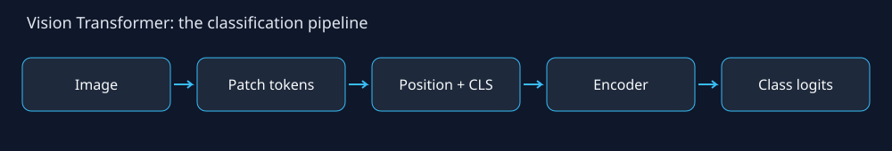

# Vision Transformers: From ViT to ViTAEv2

A step-by-step educational notebook by **Maram Alzahrani** on image tokens, self-attention, and combining local convolution with global attention.

Based on **ViTAEv2: Vision Transformer Advanced by Exploring Inductive Bias for Image Recognition and Beyond** (Zhang et al., arXiv:2202.10108v2, 2022).



## Open the tutorial

- [Read the notebook on GitHub](Vision_Transformer_Tutorial.ipynb)
- [Run in Google Colab](https://colab.research.google.com/github/Maram1alzahrani/ViT/blob/main/Vision_Transformer_Tutorial.ipynb)

## What you will learn

1. Split an image into patches and create embeddings.
2. Add position embeddings and a CLS token.
3. Compute and visualize attention.
4. Build a small ViT classifier in PyTorch.
5. Understand the paper's PRM, PCM, Reduction Cells, Normal Cells, and four-stage ViTAEv2 design.
6. Explore multi-scale convolution and local/global feature fusion.
7. Optionally train two educational classifiers on CIFAR-10 and select a checkpoint using validation data.

## Run locally

```bash
git clone https://github.com/Maram1alzahrani/ViT.git
cd ViT
python -m pip install -r requirements.txt
```

Open `Vision_Transformer_Tutorial.ipynb` in VS Code or Jupyter and run cells in order. Use a Python 3.10+ kernel. If needed, install Jupyter separately with `python -m pip install jupyterlab`.

The core tutorial runs on CPU with synthetic images and needs no dataset download. The CIFAR-10 section is disabled by default; set `RUN_CIFAR10 = True` to enable it. Defaults: 3 epochs, 2,000 training images, 500 validation images, batch size 64. GPU is recommended for training. Training saves `educational_classifier.pt` locally.

## Scientific scope

`TinyViT` and `EducationalHybrid` are small models built for explanation. **EducationalHybrid is not ViTAEv2**, cannot load official checkpoints, and does not reproduce the paper's architecture or training recipe. Untrained attention maps are computation demonstrations. No measured recognition results are included in this repository.

The optional comparison uses the same data split and training budget, but differs in architecture, token count, and parameter count. It is not a controlled ablation or evidence that one architecture is generally better. The official test split is evaluated only after validation-based selection.

## Sources

- [ViTAEv2 paper, arXiv v2](https://arxiv.org/abs/2202.10108v2)
- [Official ViTAE implementation](https://github.com/ViTAE-Transformer/ViTAE-Transformer)
- [Original ViT paper](https://arxiv.org/abs/2010.11929)

The uploaded paper was used as a reference; the paper PDF and original implementation are not redistributed here.
